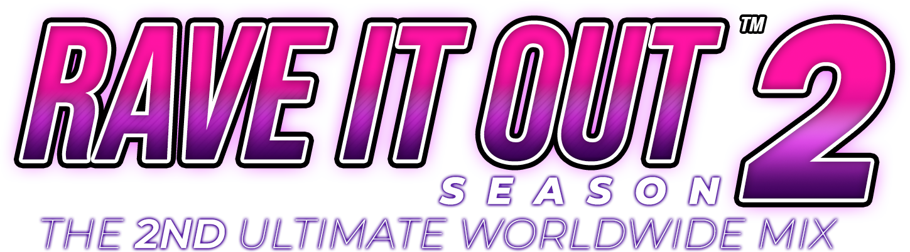

# Rave It Out: Season 2

The Official Rave It Out theme. Pitbull would approve. Dale!

# Features
- Customizable loading screen wallpapers: Put as many wallpapers as you want in Graphics/_RandomWalls/HDWalls/ to have them show up.
- Favorites folder: Press DownLeft+DownRight during evaluation to favorite a song. A favorites folder will appear in the group select.
- Change Sort: Folders to change the sort are in the music wheel. Sort by group, title, artist name, origin/year, or level singles or level doubles.
- Auto Velocity: Set the speed of the notes to whatever you prefer.
- ~~Target Score Graph: Target your best score, machine best score, or a percentage (70%, 80%, 90%, 95%, 100%)~~ Broken currently.
- Customizable Judgment Graphic: Choose from a variety of options to change how the judgment graphic looks when you hit a note.
- Fast/Slow (Pro Mode only): Show Fast or Slow if you hit a note fast or slow. Shows the number of fasts and slows you get during results.
- Extra Stage: While Event Mode is off, get >90% accuracy in a song to obtain a bonus heart. Obtain two to bonus hearts to play an extra stage.
- One More Extra Stage/Encore Extra Stage/Special Stage: If you have a extra1.crs in the song group, it is the designated Extra Stage. If you get >95% in the Extra Stage, you will be taken to the OMES, which is defined in 01 SYSTEM_PARAMETERS.lua.
- Customizable song related items: Show a special background in the loading screen after playing a song, show a message before playing a song, etc... Check Song Structure Documentation.txt for more information.
- ~~Quest Mode: Play through some missions. Since this requires having the songs, I'd leave this disabled.~~
- Mixtapes Mode: it's course mode.
- Card Reader support: Join in with a supported card and card reader. You need the RIO fork to use this feature.
- USB Profile support: This theme fully supports USB profiles including a screen for setting your name.
- USB Songs: You can play songs from USB, just stick them in the Songs directory of your profile directory. Make sure to enable from machine settings.

## Usage
Works on [SM-RIO](https://github.com/RhythmLunatic/stepmania/tree/starworlds) only, because:

- ~~Card Reader support~~ Currently nonfunctional
- level folders
- co-op x4
- Additional lua function for courses, which is needed because Mixtapes Mode is entirely lua
- ScreenWithOptionsList, also needed for mixtapes mode.
- Various other changes

Configure the groups for Easy and Special mode along with courses in 01 SYSTEM_PARAMETERS.lua.

Supports Dance and Pump mode, although the graphics will still be for pump. (May support other modes too, but you'll probably get some bugs)

## Configuration

Check the operator menu. Edit 01 SYSTEM_PARAMETERS.lua.

## Adding new songs

Check Song Structure Documentation.txt.

## Who worked on this?

Check BGAnimations/ScreenCredits Overlay/default.lua for credits and open source libraries used.

## License
Rave It Out (The theme, the name, the game, the charts) is public domain. However, some files and libraries used have their own terms. These files will have their own license at the top.

Read LICENSE for more information.

The files that are not covered under public domain are:
- Scripts/00 json.lua (MIT, Copyright (c) 2019 rxi)
- Parts of Scripts/wheel.lua (MIT, Daniel Joshua Guzek & Inorizushi)
- Scripts/04 item_scroller.lua (MIT, Kyzentun)
- Everything in the Sounds folder. Sorry, we didn't make most of it.
- Graphics/_RandomWalls/HDWalls. You're supposed to provide your own!
- In BGAnimations/ScreenSelectProfile overlay:
- card_unit.png
- checking_card_unit.png
- frame_p1.png & frame_p2.png
- m_transmission.png

```
I dedicate any and all copyright interest in this software to the
public domain. I make this dedication for the benefit of the public at
large and to the detriment of my heirs and successors. I intend this
dedication to be an overt act of relinquishment in perpetuity of all
present and future rights to this software under copyright law.
```